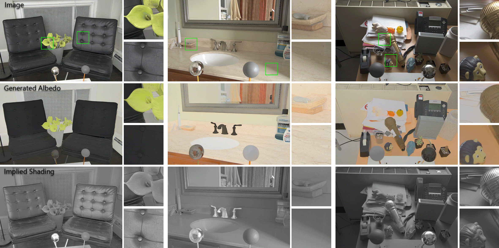

# MIDIntrinsics

Repo for the intrinsic component extension of MIT Multi-Illumination Dataset proposed in the paper "Intrinsic Image Decomposition via Ordinal Shading", [Chris Careaga](https://ccareaga.github.io/) and [Yağız Aksoy](https://yaksoy.github.io), ACM Transactions on Graphics, 2023 
### [Project Page](https://yaksoy.github.io/MIDIntrinsics/) | [Paper](https://yaksoy.github.io/papers/TOG23-Intrinsic.pdf) | [Video](https://youtu.be/pWtJd3hqL3c) | [Supplementary](https://yaksoy.github.io/papers/TOG23-Intrinsic-Supp.pdf) | [Data](https://1sfu-my.sharepoint.com/:f:/g/personal/ctc32_sfu_ca/EjZMBeiaFehHiRh0pBCNcDoBLA-e4g5prym4zjIfIiRCUA?e=UFNUsZ)



### Downloading the data
To compute intrinsic components for each image in MID, you must first download [the original dataset](https://projects.csail.mit.edu/illumination/). We provide the linear albedo images created from the HDR images in the dataset after white-balancing and tonemapping. You can use `wget` to download the zip archives:

```
wget https://data.csail.mit.edu/multilum/multi_illumination_test_mip2_exr.zip
wget https://data.csail.mit.edu/multilum/multi_illumination_train_mip2_exr.zip
```
We provide a single albedo image for each scene, these can be downloaded [here](https://1sfu-my.sharepoint.com/:f:/g/personal/ctc32_sfu_ca/EjZMBeiaFehHiRh0pBCNcDoBLA-e4g5prym4zjIfIiRCUA?e=UFNUsZ). Once downloaded the zip archive can be placed next to the extracted MID data and the albedo images can be extracted directly into the MID directory structure:
```
unzip midi_train_albedo.zip -d multi_illumination_train_mip2_exr/
unzip midi_test_albedo.zip -d multi_illumination_test_mip2_exr/
```
Since the albedo is computed from the tonemapped images, the shading images should be computed using the tonemapped images as well. We use the simple [tonemapping function](https://github.com/CCareaga/chrislib/blob/667ddf1853683cfcfa21c9fcc435b92b2487e9b1/chrislib/general.py#L437-L479) used by rendered datasets. The shading can be computed as:
```
tm_scale = get_tonemap_scale(img)
tm_img = (tm_scale * img).clip(0, 1)
shading = tm_img / albedo
```
This will generate a three-channel shading image. For training intrinsic decomposition methods that use the grayscale shading assumption, the shading images can be desaturated using a function [like this](https://github.com/CCareaga/chrislib/blob/667ddf1853683cfcfa21c9fcc435b92b2487e9b1/chrislib/general.py#L284C1-L306C22). There are then two options for dealing with the desaturation. You can either push the color into the albedo image, ensuring that the input image is maintained and reconstructed, at the cost of each image potentially having slightly different albedo ground-truth:
```
new_albedo = tm_img / grey_shading
```
Or you can re-synthesize the input image from the original albedo and the grayscale shading:
```
new_img = albedo * grey_shading
```
This will essentially white-balance the input image and remove/alter any non-grayscale lighting effects captured by the three-channel shading (e.g. shadows, specularity, etc.). It will however ensure that each image shares a single albedo component.

Although it's not recommended, the albedo components can be used with the JPEG images in the Multi-Illumination Dataset. Since the albedo is linear, you must undo the gamma correction on the JPEG images before dividing by the albedo:
```
shading = (img ** 2.2) / albedo
```
Again, this is not recommended as the JPEG images may have artifacts and lost information that can be amplified when performing operations like division resulting in an inaccurate shading layer. 

### Generating the data

Alternatively, you can use our pipeline to re-generate the albedo estimations in case you want more flexibility. To do this you can download the original dataset in the same way. Then you can install our [intrinsic decomposition pipeline](https://github.com/compphoto/Intrinsic):
```
pip install https://github.com/compphoto/Intrinsic/archive/master.zip
```
To generate the albedo estimations, you can run the `generate_albedo` script and point it to the downloaded multi-illumination data:
```
$ python generate_albedo.py --help

usage: generate_albedo.py [-h] [--mid_path MID_PATH] [--weights_path WEIGHTS_PATH] [--save_imgs] [--png]

optional arguments:
  -h, --help            show this help message and exit
  --mid_path MID_PATH   path to the Multi-Illumination Dataset (train or test)
  --weights_path WEIGHTS_PATH
                        path to the Multi-Illumination Dataset (train or test)
  --save_imgs           whether or not to save preprocessed images as PNG
  --png                 whether or not to save output as PNGs by default the albedo is saved as EXR

```
The images will be white-balanced using the light probe, tonemapped, and decomposed using our method and the median albedo will be computed. Each albedo will be stored alongside the HDR images. 

### License
<p xmlns:cc="http://creativecommons.org/ns#" >The provided albedo images are licensed under <a href="http://creativecommons.org/licenses/by-nc-sa/4.0/?ref=chooser-v1" target="_blank" rel="license noopener noreferrer" style="display:inline-block;">CC BY-NC-SA 4.0</a></p>
and intended for research purposes only. You can freely use it for scientific publications and include them in figures.

The methodology employed to generate this dataset is safeguarded under intellectual property protection. For inquiries regarding licensing opportunities, kindly reach out to SFU Technology Licensing Office <tlo_dir ατ sfu δøτ ca> and Yağız Aksoy <yagiz ατ sfu δøτ ca>.


### Citation
This implementation is provided for academic use only. Please cite our paper if you use this code or dataset:

```
@ARTICLE{careagaIntrinsic,
  author={Chris Careaga and Ya\u{g}{\i}z Aksoy},
  title={Intrinsic Image Decomposition via Ordinal Shading},
  journal={ACM Trans. Graph.},
  year={2023},
}
```
